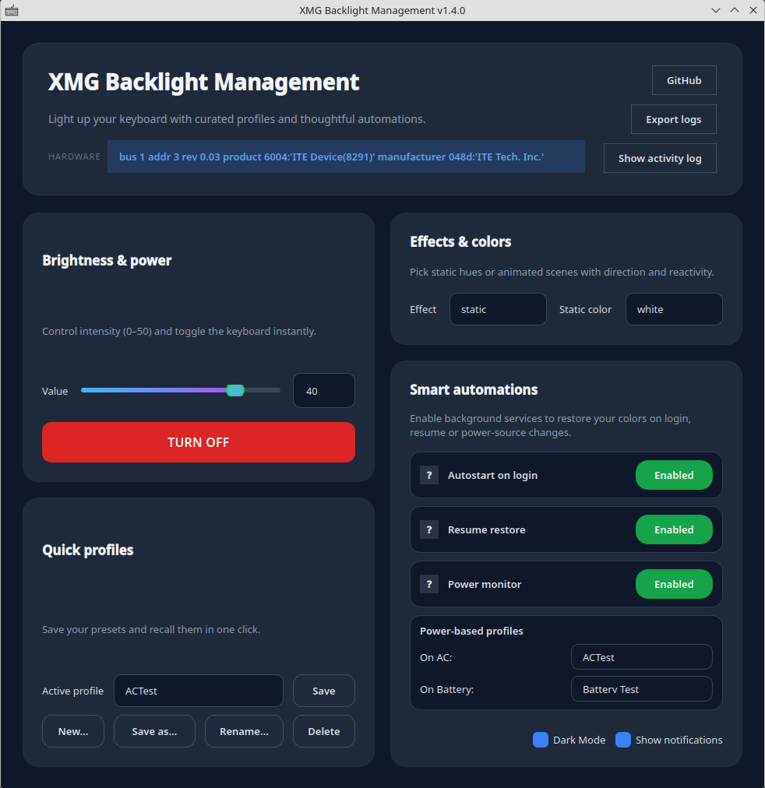

# XMG Backlight Installer

XMG Backlight Installer helps you deploy the **backlight-linux** GUI for ITE 8291 RGB keyboards found in XMG/Tongfang laptops. It installs the GUI and uses systemd user services so your last profile can be restored automatically after suspend/hibernate and power-source changes.

Special thanks to **Barnabás Pőcze** and contributors for the `ite8291r3-ctl` driver. Without their excellent work, this GUI would not be possible.

## Screenshot



## Repository layout

| Path | Purpose |
| --- | --- |
| `source/` | Upstream scripts (GUI, restore helper, power monitor). |
| `install.py` | Top-level installer script to run with sudo. |
| `.gitignore` | Local development exclusions (bytecode, build artifacts, IDE files, etc.). |

## Requirements

* Linux distribution with `systemd` user sessions (tested on Fedora; other distros may need tweaks).
* Python 3.10+ with `pip`.
* Root privileges to deploy files under `/usr/share`, `/usr/local/bin`, `/etc/xdg`, etc.
* USB access to the keyboard controller (ensure `ite8291r3-ctl` works on your device).

## Installation

1. Clone the repository and enter the project directory:
   ```bash
   git clone https://github.com/Darayavaush-84/xmg_backlight_installer.git
   cd xmg_backlight_installer
   ```
2. Run the installer as root:
   ```bash
   sudo python3 install.py
   ```
3. Launch **XMG Backlight Management** from your desktop menu, the GUI will automatically load in the systray, with double click you can open it and enable the automation toggles (resume + power monitor) if desired.

## Uninstallation

To remove the installed files and configurations:

```bash
sudo python3 install.py --uninstall
```

When run without additional flags, the installer will prompt you to choose:
1. **Partial removal** - removes system files plus user services/autostart entries (keeps user profiles)
2. **Full removal** - removes everything including pip packages and user profiles

### Command-line flags

For scripted/non-interactive uninstallation:

```bash
# Remove system files only
sudo python3 install.py --uninstall

# Also remove pip packages (ite8291r3-ctl, PySide6, shiboken6)
sudo python3 install.py --uninstall --purge

# Also remove user profiles (~/.config/backlight-linux/)
sudo python3 install.py --uninstall --purge-user-data

# Full removal (pip packages + user profiles)
sudo python3 install.py --uninstall --purge --purge-user-data
```

The installer performs these actions:
* Installs `ite8291r3-ctl` and `PySide6` via `pip` only if missing.
* Copies the GUI scripts (`keyboard_backlight.py`, `restore_profile.py`, `power_state_monitor.py`) into `/usr/share/xmg-backlight`.
* Creates a launcher wrapper at `/usr/local/bin/xmg-backlight` and a desktop entry under `/usr/share/applications`.
* Creates a disabled system-wide autostart entry at `/etc/xdg/autostart/xmg-backlight-restore.desktop` (optional restore helper).
* Probes for compatible ITE 8291 keyboards; if none are found you can abort safely and the just-installed driver will be removed automatically.
* Resume restore and power monitoring are controlled from the GUI using systemd user services.

## System tray and notifications

The GUI exposes two user-facing preferences (stored under `~/.config/backlight-linux/settings.json`):

- **Add in systray** - start the application minimized to the system tray and keep it running even when the window is closed. A tray icon provides quick actions (Show/Hide window, Turn on/off, Profiles submenu, Quit).
- **Show notifications** - toggle desktop toasts emitted by the tray commands (short messages such as "Minimized to tray").

The tray icon includes a **Profiles** submenu that lets you switch between saved profiles without opening the main window.

Both options live in the "Smart automations" card on the right-hand side of the GUI.

## Power-based profiles

You can assign different profiles for AC power and battery operation:

1. Create the profiles you want (e.g., "Bright" for AC, "Dim" for battery).
2. In the **Smart automations** section, use the "On AC" and "On Battery" dropdowns to assign profiles.
3. Enable the **Power monitor** toggle.

When the power source changes, the monitor automatically switches to the configured profile and applies it. If no profile is assigned for a power state, the current active profile is used.

## Profile management

The **Quick profiles** card provides full profile management:

- **New...** - Create a fresh profile with default settings (static white, brightness 40).
- **Save** - Save changes to the current profile.
- **Save as...** - Duplicate the current profile under a new name.
- **Rename...** - Rename the active profile.
- **Delete** - Remove the active profile (at least one must remain).

## Dark mode

Enable **Dark Mode** in the Smart automations section for a dark UI theme. The dark theme applies to the main window and all dialogs.

## Testing resume restore

1. Trigger a suspend/resume cycle from your desktop environment.
2. After resume, confirm the keyboard lights restored automatically.
3. Inspect the user service log for troubleshooting:
   ```bash
   journalctl --user -u keyboard-backlight-resume.service -b
   ```

If the keyboard stays dark but manual restore works (`python3 /usr/share/xmg-backlight/restore_profile.py`), inspect the log above to understand which phase failed.

## Troubleshooting

* **Permissions:** If `ite8291r3-ctl query --devices` fails with a permission error, add a udev rule for your USB device or adjust group permissions.
* **Installer log:** The installer writes to `/var/log/xmg-backlight/installer.log`. GUI log exports include it when available.

## Development workflow

* Use the files under `source/` as the canonical payload: modify them there, then re-run the installer to copy updates into `/usr/share/xmg-backlight`.
* Keep the installer idempotent; re-running it should refresh deployed files without breaking existing installs.
* When adding integrations (systemd user services, autostart), place the generator logic in `install.py` so deployments remain reproducible.
* Run `python3 -m pytest` (if you add tests) or manual smoke tests: start the GUI, toggle automation, run suspend/resume, and inspect `journalctl --user -u keyboard-backlight-resume.service -b`.

## Credits

This installer/GUI bundle builds on top of the excellent [`pobrn/ite8291r3-ctl`](https://github.com/pobrn/ite8291r3-ctl) userspace driver.
- **Driver and low-level tooling:** (c) Barnabás Pőcze and contributors (GPL licensed).
- **GUI and automatic installer:** developed by @Darayavaush-84 to provide a PySide-based interface and user services that simplify deployments on XMG/Tongfang laptops.

## License

* **GUI and installer code** (authored by **Dario Barbarino**): released under the **GNU General Public License v3.0**.
* **Underlying driver (`ite8291r3-ctl`)**: distributed under **GNU GPL v2.0** per the upstream project. Its license text is stored in [`source/LICENSE`](source/LICENSE).

**License note (driver):** `ite8291r3-ctl` is a separate GPL v2.0-only project. This repository ships its source and installs the driver via pip; the GUI only invokes the CLI and does not import or link against the driver code. This is distributed as a separate component (mere aggregation), so the GUI remains GPL v3.0 while the driver remains GPL v2.0. If you modify the driver, those changes must remain GPL v2.0 and be redistributed accordingly.

When contributing, keep your changes compatible with GPL v3 for the GUI/installer and respect the upstream GPL v2 requirements for the driver portion.
