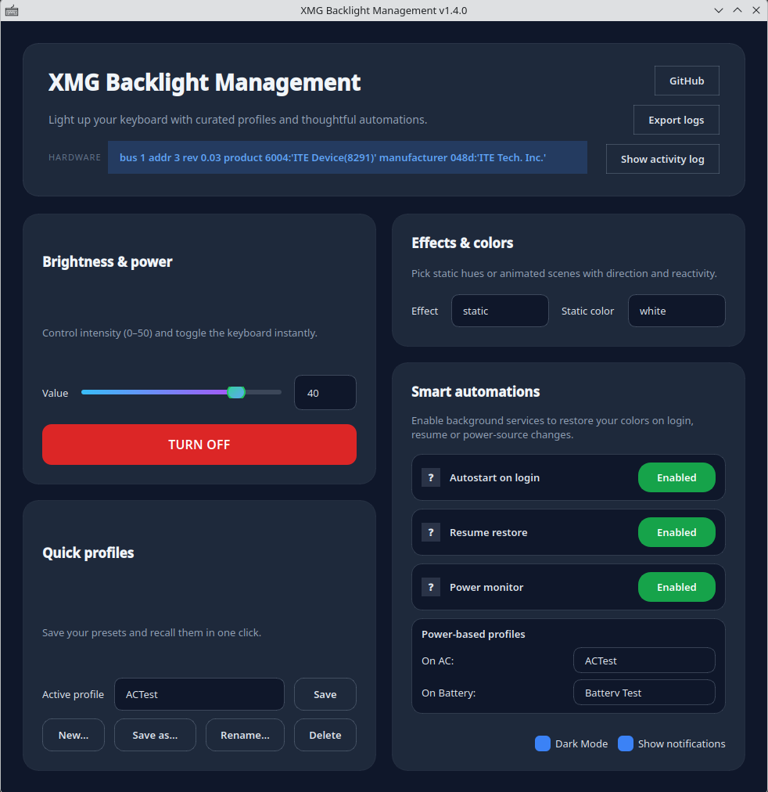

# XMG Backlight Installer

XMG Backlight Installer deploys XMG Backlight Management, a PySide6 GUI for
ITE 8291 RGB keyboard controllers used in XMG/Tongfang laptops. Release 2.5.0-rc1
ships its own audited driver wheel: it does not depend on, replace, or fall
back to an unrelated `ite8291r3-ctl` installation.

The low-level driver is derived from
[`pobrn/ite8291r3-ctl`](https://github.com/pobrn/ite8291r3-ctl) 0.4. Thanks to
Barnabás Pőcze and all upstream contributors for their work.



## What is bundled

| Path | Purpose |
| --- | --- |
| `driver/` | Source and GPLv2 license of the bundled driver fork. |
| `vendor/` | Versioned driver and pyusb wheels plus their SHA-256 manifest. |
| `source/xmg_backlight/` | GPLv3 GUI, automation daemon, persistence, and diagnostics. |
| `installer_lib/` | Artifact, ownership, transaction, process, and udev logic. |
| `tests/` | Headless logic and integration tests. |
| `install.py` | Transactional system installer and uninstaller. |

The bundled driver currently accepts only these explicit device/revision
combinations:

| USB ID | Revision |
| --- | --- |
| `048d:6004` | `0003` |
| `048d:6006` | `0003` |
| `048d:600b` | `0003` |
| `048d:ce00` | `0003` |

An unknown product or revision is rejected rather than treated as compatible.

## Requirements

- Linux with udev, libusb, systemd user sessions, login1, and UPower D-Bus.
- Python 3.10 or newer with the `venv` module and pip.
- Root privileges for the system installation.
- Network access to install the pinned `PySide6==6.11.0` GUI dependency.

The driver and pyusb wheels are local repository artifacts and are installed
offline with `--no-index --no-deps`. Runtime packages are never installed into
the system Python.

The bundled driver uses direct USB access and cannot safely share the same HID
interface with the `ite_8291` module from `tuxedo-drivers`. This release
candidate does not alter modprobe configuration automatically. Systems using
that module should treat XMG Backlight and the kernel RGB driver as alternative
owners and report any TUXEDO Control Center interaction during testing.

## Installation

```bash
git clone https://github.com/Darayavaush-84/xmg_backlight_installer.git
cd xmg_backlight_installer
sudo python3 install.py
```

The installer preserves a dedicated environment at:

```text
/usr/local/lib/xmg-backlight-venv
```

For every installation or upgrade it creates a fresh temporary venv, validates
the pinned GUI dependency and bundled driver, rewrites generated venv metadata
for the final path, and validates the committed environment again. The venv,
application package, wrappers, desktop entry, udev rule, and ownership manifest
are replaced through a rollback-capable filesystem transaction.
Immediately before that transaction, the installer safely identifies, closes,
and waits for any running GUI instance; unrelated Python processes are ignored.

The ownership manifest is stored at
`/var/lib/xmg-backlight/install-manifest.json`. It records exact hashes for
managed files and complete directory trees. Existing unowned or locally
modified targets are refused.

The installed USB rule is `/etc/udev/rules.d/70-xmg-backlight.rules`. It uses
`TAG+="uaccess"`, so access is granted to the active local session without a
world-writable `0666` device node.

Use `--skip-update-check` only when intentionally installing this checked-out
version without consulting the latest GitHub release metadata.

## Uninstallation

The default operation removes the managed system application and user
integrations for the invoking desktop user, while retaining the dedicated venv
and user profiles:

```bash
sudo python3 install.py --uninstall
```

Additional explicit scopes are available:

```bash
# Also remove the dedicated application venv
sudo python3 install.py --uninstall --purge

# Also remove the invoking user's profiles/settings
sudo python3 install.py --uninstall --purge-user-data

# Purge profiles/settings and integrations for every desktop user
sudo python3 install.py --uninstall --purge-user-data --all-users

# Full system and all-user purge
sudo python3 install.py --uninstall --purge --purge-user-data --all-users
```

Destructive flags without `--uninstall` are rejected. `--all-users` also
requires `--purge-user-data`. Before removing anything, the uninstaller checks
every requested target; a modified or unowned artifact aborts the operation.
System files and directories are then removed transactionally. There is no
global-pip cleanup and no package-uninstall fallback.

## Profiles and persistence

Profiles, preferences, and AC/battery assignments live in one private,
locked document:

```text
~/.config/backlight-linux/state.json
```

Release 2.5.0-rc1 migrates the older `profile.json` and `settings.json` documents
once. Writes use a unique temporary file, `fsync`, and atomic replacement.
Profile revisions prevent stale writers from overwriting newer state. Renaming
or deleting a profile updates its power assignments in the same atomic commit.

If a power state has no assigned profile, automation performs no change; it
does not silently apply another profile.

## Resume and power automation

Both features use one user unit:

```text
keyboard-backlight-automation.service
```

The daemon listens to login1 `PrepareForSleep(bool)` and UPower
`PropertiesChanged` events. It does not synthesize user `sleep.target` units,
poll the clock, or guess that a time jump means resume. Enabling either feature
reconciles and restarts the managed unit so upgraded code is used immediately.

Useful diagnostics:

```bash
systemctl --user status keyboard-backlight-automation.service
journalctl --user -u keyboard-backlight-automation.service -b
ite8291r3-ctl query --devices
```

The GUI log export creates an atomic ZIP containing the unified state,
installer log when readable, driver information, automation journal, activity
buffer, and a `collection-report.json` that lists collection errors explicitly.

## Development and verification

Run the complete headless suite from the repository root:

```bash
python3 -m unittest discover -s tests -v
python3 -m compileall -q install.py installer_lib source driver/src tests
```

The suite covers command capabilities, state verification, persistence and
migration, profile transformations, automation events, service ownership,
driver timeouts, diagnostics, installer transactions, artifact tampering,
udev security, venv relocation, and offline wheel installation.

To rebuild the driver wheel, build from `driver/`, replace only the matching
artifact under `vendor/`, and update its SHA-256 in `vendor/manifest.json`.

## License

- GUI and installer: GNU GPL v3.0-only; see [`LICENSE`](LICENSE).
- Bundled `ite8291r3-ctl` fork: GNU GPL v2.0-only; see
  [`driver/LICENSE`](driver/LICENSE).

The driver is distributed as a separate command-line component. The GUI invokes
its executable and does not import or link its Python package.
